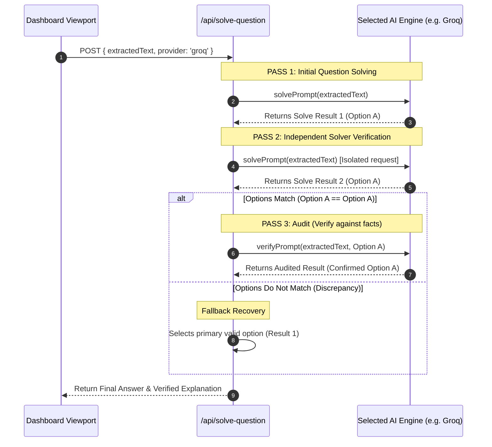
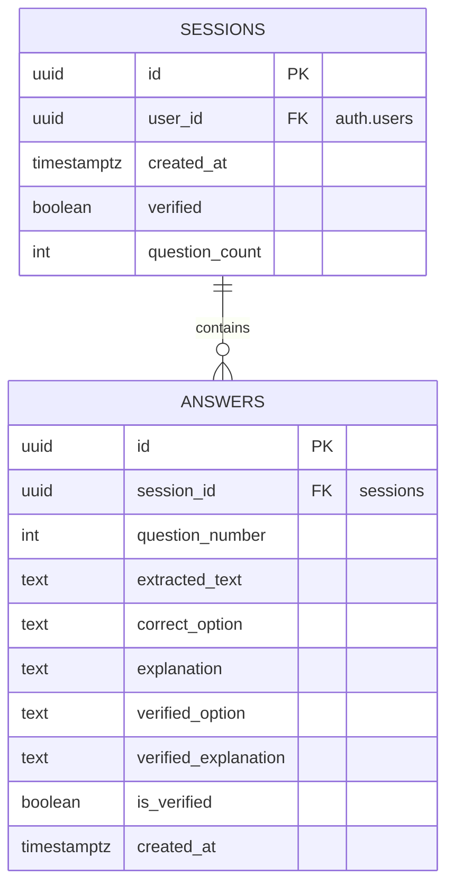

# SnapQuiz (MCQ Scanner) — Professional Engineering Report

SnapQuiz is a high-performance, single-purpose web application designed for students and educators to scan, solve, and archive multiple-choice questions (MCQs) instantly using their device camera. Embodying a modern Gen-Z dark-themed cyberpunk aesthetic with sleek neon accents, glassmorphic structures, and high-fidelity micro-animations, SnapQuiz delivers a premium user experience (UX) backed by deep server-side and browser resilience.

---

## 1. Executive Summary

SnapQuiz leverages modern cloud services, advanced large language models (LLMs), and browser hardware APIs to streamline the process of solving and auditing multiple-choice questions.

### 1.1 The Core Problem
Translating printed or digital questions into actionable, well-explained solutions is traditionally slow and manual. Students and educators waste time transcriptionally copying text, and standard OCR apps do not provide detailed contextual explanations, let alone correct discrepancies.

### 1.2 The Solution
A unified, camera-based web scanner that:
1. Performs real-time optical character recognition (OCR) directly in the browser using WASM-powered client-side OCR.
2. Solves the captured question using an advanced, multi-provider AI engine.
3. Automatically triggers a multi-pass AI verification audit to verify options and explanations before confirming them.
4. Stores the entire history securely in a private, multi-tenant database.
5. Runs fluidly on mobile platforms (including iOS Safari) with adaptive viewport structures, orientation responsiveness, and power conservation.

### 1.3 Primary Tech Stack
- **Framework**: Next.js 14 (App Router, dynamic API endpoints, TypeScript).
- **Client OCR Engine**: Tesseract.js (running WebAssembly workers in a separate thread).
- **Database & Authentication**: Supabase (PostgreSQL, Row-Level Security, Google OAuth gateway).
- **Core AI Solver & Auditor**: Groq (Llama 3 8B - Default) / Gemini 2.5 Flash / GPT-4o / Claude 3.5 Sonnet / Grok 1.5.
- **Styling & Theme**: Vanilla CSS with custom utility variables, aspect-ratio bounds, backdrop blur panels, and smooth micro-animations.

---

## 2. System Architecture & Workflow

SnapQuiz is designed on a modular three-tier client-server architecture to ensure clear division of concerns, sub-second latency, and horizontal scalability.

### 2.1 System Architecture Diagram

```mermaid
graph TD
    subgraph Client [Client-Side Layer (Next.js / React)]
        A[Login Page / Auth Gate] -->|OAuth Session| B[Dashboard Page]
        B -->|HTML5 MediaDevices| C[CameraView Component]
        B -->|State Render| D[AnswerList Component]
        B -->|Toast Dispatch| E[Toast notification system]
    end

    subgraph Server [Server-Side Middleware & API Routes]
        F[Next.js Middleware] -->|Session Cookie Validation| B
        G[api/solve-question] -->|Orchestrates 3-Pass Solve & Audit| H[Groq / Gemini Solver Engine]
        I[api/solve] -->|Legacy Orchestration Route| J[ai.ts Solver Router]
        K[api/verify] -->|Legacy Multi-Pass Verifier Route| L[ai.ts Verifier Router]
    end

    subgraph External [External Cloud Services]
        H -->|Groq API Chat Completion| M[Groq Cloud / Llama 3]
        J -->|Structured Answer Gen| N[Gemini / ChatGPT / Claude / Grok]
        L -->|Multi-pass Check| N
        B -->|SSR Server Client| O[Supabase Database]
        G -->|Service Client Insert & Update| O
        I -->|Service Client Insert| O
        K -->|Service Client Update| O
    end
```

### 2.2 Complete Code Catalog (File Locations & Roles)

| File Path | Total Lines | Technical Responsibility |
| :--- | :--- | :--- |
| [`app/page.tsx`](file:///c:/Users/KIIT/Desktop/BACKUP%20Internship/SnapQuiz/app/page.tsx) | ~120 lines | **Landing & Auth Gate**: Persists chosen AI in local storage; initializes Supabase OAuth redirection. |
| [`app/dashboard/page.tsx`](file:///c:/Users/KIIT/Desktop/BACKUP%20Internship/SnapQuiz/app/dashboard/page.tsx) | 449 lines | **Application Core Panel**: Orchestrates OCR, auto-scan timeouts (2.5s loop), keyboard listeners, and sidebar rendering. |
| [`components/CameraView.tsx`](file:///c:/Users/KIIT/Desktop/BACKUP%20Internship/SnapQuiz/components/CameraView.tsx) | 353 lines | **Viewfinder Engineering**: Handles canvas drawing, video streaming constraints (ultra-wide/facingMode), mirror transforms, and tab-visibility observers. |
| [`components/AnswerList.tsx`](file:///c:/Users/KIIT/Desktop/BACKUP%20Internship/SnapQuiz/components/AnswerList.tsx) | 94 lines | **State Render Component**: Renders question cards; displays the "Corrected" warning badge if the auditor revises an answer. |
| [`app/api/solve-question/route.ts`](file:///c:/Users/KIIT/Desktop/BACKUP%20Internship/SnapQuiz/app/api/solve-question/route.ts) | 152 lines | **Secure Server-Side API**: Keeps API keys safe. Employs 3-pass audit flow utilizing Groq (Llama 3 8B) as the default provider. |
| [`app/api/solve/route.ts`](file:///c:/Users/KIIT/Desktop/BACKUP%20Internship/SnapQuiz/app/api/solve/route.ts) | 105 lines | **Solve API Router**: Validates user session cookies, calls AI Router, and saves initial scanned answers to Supabase. |
| [`app/api/verify/route.ts`](file:///c:/Users/KIIT/Desktop/BACKUP%20Internship/SnapQuiz/app/api/verify/route.ts) | 89 lines | **Verify API Router**: Batch fetches session answers, triggers AI Router verification pass, and updates entries in database. |
| [`lib/ai.ts`](file:///c:/Users/KIIT/Desktop/BACKUP%20Internship/SnapQuiz/lib/ai.ts) | 201 lines | **Multi-LLM Router**: Proxies and formats prompts/responses across Google, OpenAI, Anthropic, and xAI APIs via raw Fetch client calls. |
| [`lib/gemini.ts`](file:///c:/Users/KIIT/Desktop/BACKUP%20Internship/SnapQuiz/lib/gemini.ts) | 168 lines | **Core Gemini Client**: Implements strict structured prompts, Regex parsers, fallback overrides, and 20s abort thresholds. |
| [`lib/supabase/client.ts`](file:///c:/Users/KIIT/Desktop/BACKUP%20Internship/SnapQuiz/lib/supabase/client.ts) | 9 lines | **Supabase Browser Client**: Initiates OAuth actions and local cookies management. |
| [`lib/supabase/server.ts`](file:///c:/Users/KIIT/Desktop/BACKUP%20Internship/SnapQuiz/lib/supabase/server.ts) | 41 lines | **Supabase Server Utilities**: Exposes standard cookie-based clients and admin Service-Role client configurations. |
| [`supabase/schema.sql`](file:///c:/Users/KIIT/Desktop/BACKUP%20Internship/SnapQuiz/supabase/schema.sql) | 50 lines | **Database Core Migrations**: Declares constraints, foreign keys, cascading deletions, and active Row-Level Security policies. |
| [`styles/globals.css`](file:///c:/Users/KIIT/Desktop/BACKUP%20Internship/SnapQuiz/styles/globals.css) | 1123 lines | **Core Design System & Styles**: Tailors brutalist dark/neon theme, glassmorphic filters, and 1:1 camera layout constraints. |

---

## 3. Advanced AI Router & Multi-LLM Orchestration

At the heart of SnapQuiz is an advanced **Unified AI Router (`lib/ai.ts`)** and **Secure Server-Side API (`/api/solve-question`)** that provides flexibility, cost optimization, and resilience. 

### 3.1 Supported AI Models & Providers
SnapQuiz integrates premium cloud-based intelligence models with secure server-side isolation:
- **Groq Cloud (Llama 3 8B - `llama3-8b-8192`)**: The high-speed default provider implemented inside the `/api/solve-question` endpoint for sub-second, highly secure completions.
- **Gemini 2.5 Flash** (via raw fetch to `generativelanguage.googleapis.com` with robust 20s timeouts).
- **ChatGPT 4o** (via `api.openai.com`).
- **Claude 3.5 Sonnet** (via `api.anthropic.com`).
- **Grok 1.5** (via `api.x.ai` using OpenAI compatibility standards).

All models are integrated using lightweight, standard `fetch` queries or official lightweight SDKs. This keeps the application package size small, avoids the overhead of complex proprietary npm SDK dependencies, and eliminates version compatibility mismatches.

### 3.2 Solving Prompt & Custom Regex Parsers
The OCR output is often noisy due to scanner shadows or document crumpling. Prompt engineering instructs the model to play the role of an expert academic tutor, reconstruct the noisy text, and return a strict, parsable format:

```text
ANSWER: [single letter A/B/C/D or number]
EXPLANATION: [concise explanation]
```

To extract answers reliably from noisy text, a robust parsing regex pipeline strip markers (`*`, `` ` ``, `#`) and matches pattern sequences:

```typescript
const answerMatch = cleanText.match(/ANSWER\s*[:\-\=]?\s*([A-D1-4])/i)
const explanationMatch = cleanText.match(/EXPLANATION\s*[:\-\=]?\s*(.+)/is)
```

**Fallback Recovery**: If the pattern fails, the parser loops through each line using boundary-safe regex lookaheads for isolated option characters (`A`, `B`, `C`, `D`), ensuring that solving states never crash during bad scanning sweeps.

### 3.3 Three-Pass Double-Verification & Audit Protocol
To guarantee high academic accuracy, the secure `/api/solve-question` API runs a **Three-Pass Audit Protocol** entirely on the server side:



1. **Pass 1 (Solve Pass)**: The API passes the noisy OCR text to the AI model to perform the initial solver pass, extracting option and explanation.
2. **Pass 2 (Independent Verification Pass)**: In parallel or sequential isolation, the same prompt is evaluated a second time to ensure consistency.
3. **Pass 3 (Fact Audit Pass)**: If Pass 1 and Pass 2 results match, the server fires a final verification prompt (**Pass 3**), specifically requesting the AI to play the role of an academic auditor, double-checking the proposed option against real-world academic facts. If a correction is made during the audit, the revised option is returned to the user, ensuring the absolute highest level of factual precision.

---

## 4. Frontend Engineering & Camera Resilience

Interacting with device hardware in modern web environments presents challenges. SnapQuiz addresses this with robust front-end browser engineering.

### 4.1 Progressive MediaStream Constraints Fallback
Many devices expose multiple virtual lenses (telephoto, wide, portrait), causing standard web camera setups to fail or grab the wrong stream. SnapQuiz implements a **progressive sequence of constraints** starting with wide-angle preferences:

```typescript
const constraintsList = [
  // 1. Ultra-wide Back Camera (if supported) with wide-angle Zoom (zoom: 0.5)
  { video: { facingMode: { ideal: 'environment' }, width: { ideal: 1280 }, height: { ideal: 720 }, zoom: { ideal: 0.5 } } },
  // 2. High Resolution Back Camera
  { video: { facingMode: { ideal: 'environment' }, width: { ideal: 1280 }, height: { ideal: 720 } } },
  // 3. Lower Resolution Back Camera
  { video: { facingMode: { ideal: 'environment' }, width: { ideal: 640 }, height: { ideal: 480 } } },
  // 4. Back camera no resolution constraints
  { video: { facingMode: { ideal: 'environment' } } },
  // 5. Any video camera stream (generic fallback)
  { video: true }
]
```
The client loops through these constraints sequentially. If permission is denied, it stops immediately. Otherwise, it scales down constraints dynamically until a successful capture stream is established.

### 4.2 iOS Safari & Android Support
Mobile browsers impose strict hardware policies. Videos will not autoplay unless they are explicitly muted and contain native tags. SnapQuiz addresses this by:
- Setting properties programmatically: `playsinline`, `autoplay`, `muted`, and disabling picture-in-picture.
- Registering touch gestures (`onClick` / `onTouchStart`) to play the viewfinder if browser sandboxing pauses the stream during rendering.
- Capturing and displaying specific user instructions for allowing permissions inside iOS Safari (`Settings → Safari → Camera → Allow`).

### 4.3 Energy and Thermal Management
Web camera streams consume significant CPU, GPU, and battery power. SnapQuiz listens to the browser **Page Visibility API**:
- **Tab Suspended**: The camera track is stopped programmatically to save resource performance and battery life.
- **Tab Reactivated**: The camera automatically restarts the progressive connection, restoring the stream instantly.

### 4.4 Symmetrical Layout Engineering (Square 1:1 Aspect Ratio)
Standard camera viewfinders tend to squish or stretch when resized between portrait mobile devices and landscape desktop viewports. SnapQuiz fixes this with CSS flex constraints and aspect ratios:
- **1:1 Square Ratio**: Forced via `aspect-ratio: 1/1;` and `.camera-video { object-fit: cover; }` which guarantees the viewfinder is always a perfect square, regardless of the browser width.
- **Zero Squishing**: Renders `.camera-container` with `flex-shrink: 0;` and bounds `max-height: 50vh;` to preserve rigid screen layout constraints on dense screens.
- **Orientation Responsiveness**: Adaptive styling variables (`--safe-top`, `--safe-bottom`, `min-height: 100dvh`) automatically scale panels when rotated to landscape mode.

---

## 5. Relational Database Schema & Row-Level Security

The storage layer is engineered inside **Supabase (PostgreSQL)**, adhering to strict multi-tenant isolation principles.

### 5.1 Relational Schema Diagram



### 5.2 Row Level Security (RLS) Policy Configurations
To ensure complete multi-tenant boundaries, Row Level Security is enabled on both tables. This prevents malicious users from querying or tampering with other students' scanning sessions:

```sql
-- Enable Row Level Security
ALTER TABLE sessions ENABLE ROW LEVEL SECURITY;
ALTER TABLE answers ENABLE ROW LEVEL SECURITY;

-- Sessions Policy: Users can only select, insert, or delete their own sessions
CREATE POLICY "Users can manage their own sessions"
  ON sessions FOR ALL
  USING (auth.uid() = user_id)
  WITH CHECK (auth.uid() = user_id);

-- Answers Policy: Users can only manipulate questions belonging to their active sessions
CREATE POLICY "Users can manage answers in their sessions"
  ON answers FOR ALL
  USING (
    session_id IN (
      SELECT id FROM sessions WHERE user_id = auth.uid()
    )
  )
  WITH CHECK (
    session_id IN (
      SELECT id FROM sessions WHERE user_id = auth.uid()
    )
  );
```

---

## 6. Setup & Deployment Guide

Follow these configuration steps to spin up SnapQuiz in a local development environment.

### 6.1 Prerequisites
- **Node.js**: v18 or higher.
- **Supabase Account**: A free project workspace.
- **AI Keys**: API keys for the AI models you plan to use (e.g., Groq API key, Google Gemini, OpenAI, Anthropic).

### 6.2 Environment Configuration
Create a `.env.local` file in the root of the project:

```env
# Supabase Configuration
NEXT_PUBLIC_SUPABASE_URL=https://your-supabase-project.supabase.co
NEXT_PUBLIC_SUPABASE_ANON_KEY=eyJhbGciOiJIUzI1NiIsInR5cCI6IkpXVCJ9...
SUPABASE_SERVICE_ROLE_KEY=eyJhbGciOiJIUzI1NiIsInR5cCI6IkpXVCJ9...

# Large Language Model Keys
GROQ_API_KEY=gsk_...
GEMINI_API_KEY=AIzaSy...
OPENAI_API_KEY=sk-proj-...
ANTHROPIC_API_KEY=sk-ant-...
XAI_API_KEY=xai-...
```

### 6.3 Local Installation
1. Install project dependencies:
   ```bash
   npm install
   ```
2. Set up the database:
   Copy the contents of `supabase/schema.sql` into the **Supabase SQL Editor** and execute the queries to configure the tables, default constraints, and RLS policies.
3. Start the Next.js development server:
   ```bash
   npm run dev
   ```
   Open `http://localhost:3000` to start scanning and solving!

---

## 7. Future Product Roadmap

SnapQuiz's architecture is built to easily support several future enhancements:

1. **Multi-Format Study Deck Exports**: Export audited sessions directly to downloadable formats like PDF Study Cards or Anki Flashcards for space-repetition review.
2. **Subject Tagging & Semantic NLP Filtering**: Train lightweight classifiers to automatically tag scanned questions by subject (e.g., Chemistry, Physics, History) based on text content.
3. **Vector Database Integration (Similarity Searches)**: Index previously scanned questions in a vector database to search for similar questions and help students find related practice material.
