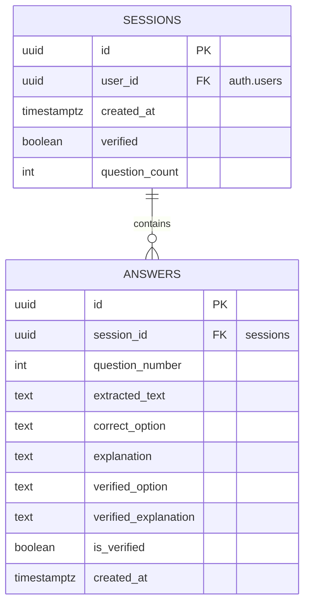
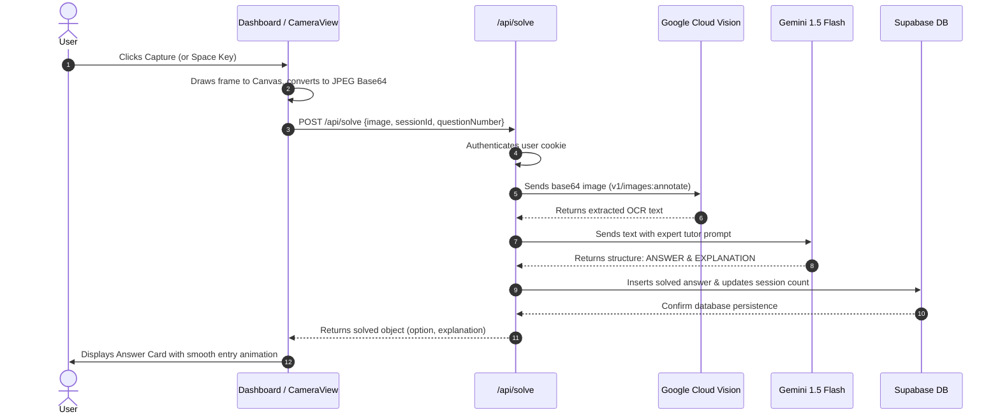

# SnapQuiz (MCQ Scanner) Project Report

SnapQuiz is a high-performance, single-purpose web application designed for students and educators to scan, solve, and archive multiple-choice questions (MCQs) instantly using their device camera. Embodying a modern Gen-Z dark-themed cyberpunk aesthetic with sleek neon accents, glassmorphic structures, and high-fidelity micro-animations, SnapQuiz delivers a premium UX combined with robust back-end resilience.

---

## 1. Executive Summary

SnapQuiz leverages modern cloud services and browser APIs to streamline the process of solving and auditing multiple-choice questions. 
- **The Core Problem**: Translating printed or digital questions into actionable solutions is slow and error-prone. Manual entry lacks structure, and generic OCR apps do not provide explanations.
- **The Solution**: A unified camera-based scanner that performs optical character recognition (OCR), solves the question via advanced generative AI, stores findings securely in a personal history database, and runs a comprehensive verification audit to ensure 100% accuracy.
- **Primary Technology Stack**:
  - **Framework**: Next.js 14 (App Router, dynamic API endpoints, TypeScript).
  - **Database & Authentication**: Supabase (PostgreSQL, Row-Level Security (RLS), Google OAuth).
  - **OCR Engine**: Google Cloud Vision API.
  - **Solver & Auditor**: Gemini 1.5 Flash (via Google Generative AI).
  - **Styling**: Tailored vanilla CSS with high-end typography, CSS custom properties, and modern UI elements.

---

## 2. System Architecture

SnapQuiz is built on a modular three-tier client-server architecture.

```mermaid
graph TD
    subgraph Client [Client-Side Layer (Next.js / React)]
        A[Login Page / Auth Gate] -->|Google OAuth| B[Dashboard Page]
        B -->|HTML5 MediaDevices| C[CameraView Component]
        B -->|State Render| D[AnswerList Component]
        B -->|Toast Dispatch| E[Toast notification system]
    end

    subgraph Server [Server-Side Middleware & API Routes]
        F[Next.js Middleware] -->|Session Validation| B
        G[api/solve] -->|Receives frame / Orchestrates flow| H[vision.ts]
        G -->|Sends extracted text| I[gemini.ts solver]
        J[api/verify] -->|Double-checks full session| K[gemini.ts verifier]
    end

    subgraph External [External Cloud Services]
        H -->|OCR API Call| L[Google Cloud Vision]
        I -->|Structured Answer Gen| M[Gemini 1.5 Flash]
        K -->|Multi-pass Check| M
        B -->|SSR Server Client| N[Supabase Database]
        G -->|Service Client Insert| N
        J -->|Service Client Update| N
    end
```

### 2.1 Component Breakdown
- **Next.js Middleware (`middleware.ts`)**: Acts as a gateway. Validates cookies using Supabase SSR (`@supabase/ssr`), dynamically guarding `/dashboard` while allowing unconfigured fallback to prevent setup-phase server crashes.
- **Camera View (`CameraView.tsx`)**: Controls device media streams. Implements sequential, progressive constraint fallbacks, mirror handling for user-facing cameras, visibility change observers, and canvas screenshotting.
- **Main Dashboard (`app/dashboard/page.tsx`)**: Coordinates application state, triggers async API fetches, handles page keyboard events (e.g., Space key to snap), and manages session state.
- **Answer List (`AnswerList.tsx`)**: Renders individual solved questions, displaying custom visual badges, verification indicators, and correction notices.

---

## 3. Database Schema & Security

The storage layer is engineered inside **Supabase (PostgreSQL)**, adhering to strict multi-tenant isolation principles through **Row Level Security (RLS)**.



### 3.1 Tables
1. **`sessions` Table**: Tracks user scanning sessions.
   - `id`: Unique UUID identifier.
   - `user_id`: Reference to authenticated Supabase user (`auth.users`).
   - `verified`: Boolean indicating if the entire session has undergone a secondary AI verification audit.
   - `question_count`: Total questions scanned in this session (capped at 10 to encourage high performance and distinct review blocks).
2. **`answers` Table**: Stores processed questions.
   - Links back to `sessions` table.
   - Persists the original raw OCR text, initial solved option, detailed tutor explanation, verified option/explanation, and a verification status flag.

### 3.2 Row Level Security (RLS) Policies
Both tables are fully private. Standard PostgreSQL policies guarantee that users can never inspect or manipulate another student's session history.
- **Sessions Policy**:
  ```sql
  CREATE POLICY "Users can manage their own sessions"
    ON sessions FOR ALL
    USING (auth.uid() = user_id)
    WITH CHECK (auth.uid() = user_id);
  ```
- **Answers Policy**:
  ```sql
  CREATE POLICY "Users can manage answers in their sessions"
    ON answers FOR ALL
    USING (session_id IN (SELECT id FROM sessions WHERE user_id = auth.uid()))
    WITH CHECK (session_id IN (SELECT id FROM sessions WHERE user_id = auth.uid()));
  ```

---

## 4. Technical Workflows

SnapQuiz relies on two primary data integration workflows designed to minimize network payloads and maximize solving accuracy.

### 4.1 MCQ Capture & Solve Workflow
When a user points the camera and captures an image, the system initiates a structured cascade:



- **Prompt Engineering**: The Gemini solver uses a tailored prompt that strictly locks the response model output to a regex-friendly block (`ANSWER: [option]` / `EXPLANATION: [tutor notes]`). If no MCQ is detected, it returns `ANSWER: UNCLEAR` which triggers a graceful user warning.

### 4.2 Multi-Pass Verification Audit
The hallmark of SnapQuiz's accuracy is its **Verification Engine**. Over the course of capturing up to 10 questions, individual solving passes might miss overall context or suffer minor transcription drift.
1. The user clicks **Verify Answers** in the sidebar.
2. The server pulls *all* scanned answers in the current session.
3. The server consolidates them into a single comprehensive validation prompt block and submits it to **Gemini 1.5 Flash**.
4. The AI plays the role of an **academic auditor**, cross-verifying each solution against the original raw OCR strings to detect solving errors.
5. If the AI detects a mismatch, it updates the answer card with the **corrected option** and supplies a revised explanation.
6. The database updates each row (`verified_option`, `verified_explanation`, `is_verified = true`) and marks the session completed.
7. The UI renders a striking **"Corrected" indicator badge** showing the correction, building deep trust and assurance for the user.

---

## 5. UI/UX & Styling System

The application design is optimized for high visual impact, rapid response times, and strong ergonomics.

### 5.1 Design Aesthetics
- **Color Palette**: Fully immersive dark theme with deep gray gradients (`#0a0a0c` to `#121216`), vibrant neon pinks/purples (`#ff2e93`, `#a855f7`), and bright greens (`#10b981`) for verification states.
- **Glassmorphism**: Panels utilize backdrop filters (`blur(16px)`) with thin, semi-transparent neon borders (`rgba(255, 255, 255, 0.08)`) to generate depth.
- **Interactive Micro-animations**:
  - Scanning states manifest a running cyan neon laser beam overlay (`.scan-line`) traversing the viewport dynamically.
  - Buttons scale down slightly (`transform: scale(0.98)`) on press.
  - Custom loading spinners match theme gradients.
- **Typography**: Adopts a sleek system font stack (`system-ui, -apple-system, sans-serif`) with bold geometric heading scales for maximum legibility.

### 5.2 Resilience & Device Engineering
- **iOS Safari Support**: Safari heavily restricts video streams. SnapQuiz includes inline plays attributes (`playsinline`, `autoplay`, `muted`) and binds secondary play listeners on viewport touch/click to override silent media pauses.
- **Progressive Stream Fallback**:
  - *Phase 1*: Attempts high-definition environment camera (`ideal: 1280x720` resolution with `facingMode: environment`).
  - *Phase 2*: Falls back to standard back camera (`ideal: 640x480`).
  - *Phase 3*: Requests any system camera without constraints.
- **Tab Focus Auto-Management**: Listens to the browser page-visibility API (`visibilitychange`). Suspends camera feeds when the tab is out of focus to save battery/thermal CPU cycles, and restores streams instantly on tab reactivation.

---

## 6. Installation & Configuration

To set up SnapQuiz locally, follow these configuration steps:

### 6.1 Prerequisites
- Node.js (v18 or higher)
- Supabase Account
- Google Cloud Platform Console Account (for Google Vision and Gemini APIs)

### 6.2 Setup Steps
1. **Clone the Repository** and install dependencies:
   ```bash
   npm install
   ```
2. **Setup Database**:
   - Create a new project on [Supabase](https://supabase.com).
   - Navigate to the SQL Editor and execute the contents of `supabase/schema.sql`.
   - Enable **Google Provider** in Auth Settings:
     - Setup your OAuth client ID and Secret under Supabase Auth Providers configuration.
3. **Configure Environment Variables**:
   Create a `.env.local` file in the root directory:
   ```env
   # Supabase Credentials
   NEXT_PUBLIC_SUPABASE_URL=https://your-supabase-url.supabase.co
   NEXT_PUBLIC_SUPABASE_ANON_KEY=your-supabase-anon-key
   SUPABASE_SERVICE_ROLE_KEY=your-supabase-service-role-key

   # API Keys
   GOOGLE_VISION_API_KEY=your-gcp-vision-api-key
   GEMINI_API_KEY=your-google-gemini-api-key
   ```
4. **Run Local Server**:
   ```bash
   npm run dev
   ```
   Open `http://localhost:3000` to start scanning!

---

## 7. Future Roadmap

While SnapQuiz is a highly polished application, several future expansions are planned:
1. **Multi-Format Export**: Support exporting audited sessions into downloadable PDF study guides or Anki flashcard decks.
2. **Subject Classification**: Automated tags (e.g., Mathematics, Physics, History) based on semantic NLP analysis.
3. **Analytics Dashboard**: Historical accuracy charts showing performance over multiple weeks of study sessions.
